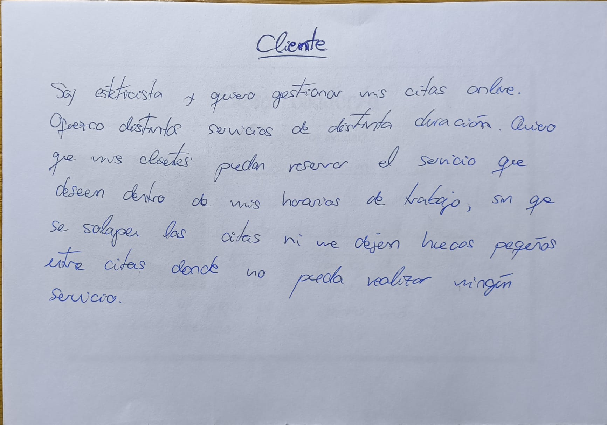

# Problema con la gestión de citas
El problema se basa en una esteticista que quiere ahorrase tiempo a la hora de asignar las citas a
los clientes por tanto en lugar de asignarlas ella manualmente mediante una agenda quiere permitir 
a los clientes que saquen su propia cita desde internet. Sus únicos requisitos son que no se puedan 
pedir citas fuera de su horario de trabajo, que no se le solapen unas citas con otras y que entre una cita
y otra no queden tiempos muertos que no sean lo suficientemente grandes como para poder añadir una nueva cita 
en medio.

# Como solucionarlo como desarrollador
Habrá que crear una página de tipo calendario donde cada usuario pueda seleccionar un día, hora y servicio. Habrá que tener en 
cuenta que los días y horarios sean dentro del horario de trabajo que tenga establecido el cliente. Hay que tener en cuenta que 
si un cliente ya tiene una cita a cierta hora, no llegue otro cliente y seleccione una cita que se solape a la anterior ya que la 
esteticista no estaría disponible. También habrá que gestionar de forma inteligente la forma de ir asignando las citas para evitar
los tiempos muertos ya que los distintos servicios que ofrece el cliente tienen distintos tiempos de duración.

# Configuración inicial
Toda la configuración inicial se encuentra en [Configuracion.md](./Configuracion.md)
