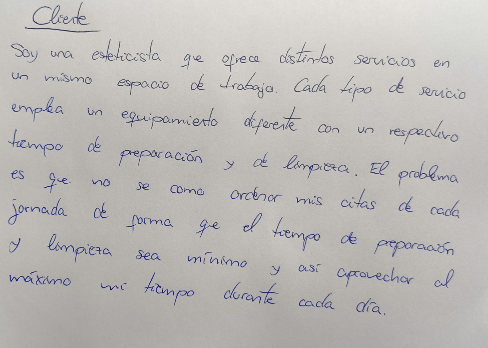

# Descripción del problema
Mi madre trabaja como esteticista, a lo largo de cada jornada laboral, recibe varias citas de clientes que solicitan distintos tipos de servicios. Entre los servicios que ofrece se encuentran tratamientos faciales, depilación láser, depilación con cera y maquillajes.

Cada tipo de servicio tiene un tiempo de duración determinado y además requiere el uso de una maquinaria o equipamiento diferente, lo que implica unos determinados tiempos de preparación antes de realizar el tratamiento y de limpieza y cambio de equipamiento una vez finalizado.

Debido a estas diferencias, el orden en el que se realizan las citas puede afectar considerablemente al tiempo efectivo de trabajo. Actualmente, resulta difícil determinar de forma sencilla qué orden de citas permite reducir al mínimo los tiempos de preparación, limpieza y cambios de equipamiento, aprovechando así al máximo el tiempo disponible durante cada jornada.

# Imagen juego rol

# Ejemplo
Es martes por la tarde y tras el trabajo mi madre está organizando las citas que tiene previstas para el martes siguiente por la mañana. En este momento tiene seis clientes que han solicitado una cita para esa franja horaria. Por ejemplo, María Ruano quiere realizarse una depilación con cera de labios y cejas, Rosa Benítez ha solicitado una sesión de depilación láser y Alberto Montoro quiere realizarse una limpieza facial.

Cada una de estas citas tiene una duración diferente y requiere un tipo de maquinaria o equipamiento determinado. Además, dependiendo del servicio que se realice antes y después, puede ser necesario invertir un tiempo adicional en la preparación, limpieza o cambio de maquinaria.

Actualmente, mi madre organiza las citas principalmente siguiendo el orden en el que los clientes han solicitado la cita, ya que no dispone de una forma sencilla de determinar cuál sería el orden más eficiente. Sin embargo, este orden puede provocar que tenga que realizar varios cambios de maquinaria y, por tanto, dedicar una parte considerable de la jornada a tareas que no generan tiempo de atención al cliente.

# Datos
Los datos necesarios para la resolución del problema me los ha proporcionado mi madre:
  - Horario de trabajo de mi madre disponible en [horario.csv](./datos/horario.csv)
  - Servicios que ofrece junto con su duración(minutos) y tipo de maquinaria o equipamiento necesario para su realización en [servicios.csv](./datos/servicios.csv)
  - Tiempos(minutos) de preparación y limpieza de cada tipo de maquinaria disponible en [maquinaria.csv](./datos/maquinaria.csv)

# Justificación de despliegue en la nube
Aunque mi madre desarrolla su actividad principalmente en su lugar de trabajo, la gestión de las citas no se realiza exclusivamente allí. En muchas ocasiones recibe y organiza las solicitudes de los clientes mientras se encuentra en casa o en cualquier otro lugar. Por este motivo, limitar el sistema a un ordenador situado en el lugar de trabajo dificultaría su utilización y obligaría a realizar la planificación de las citas desde un único dispositivo.

Mediante el despliegue en la nube, el sistema podrá estar disponible de forma remota a través de Internet, permitiendo que mi madre realizar su planificación desde cualquier lugar, utilizando un ordenador, teléfono móvil u otro dispositivo.

# Configuración inicial
Toda la configuración inicial se encuentra en [Configuracion.md](./Configuracion.md)
